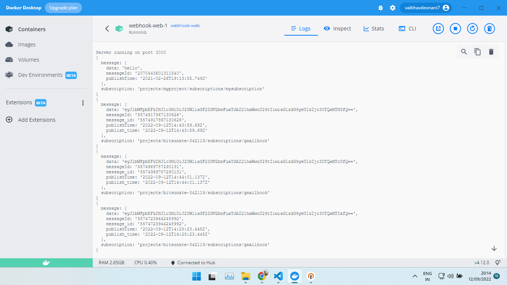
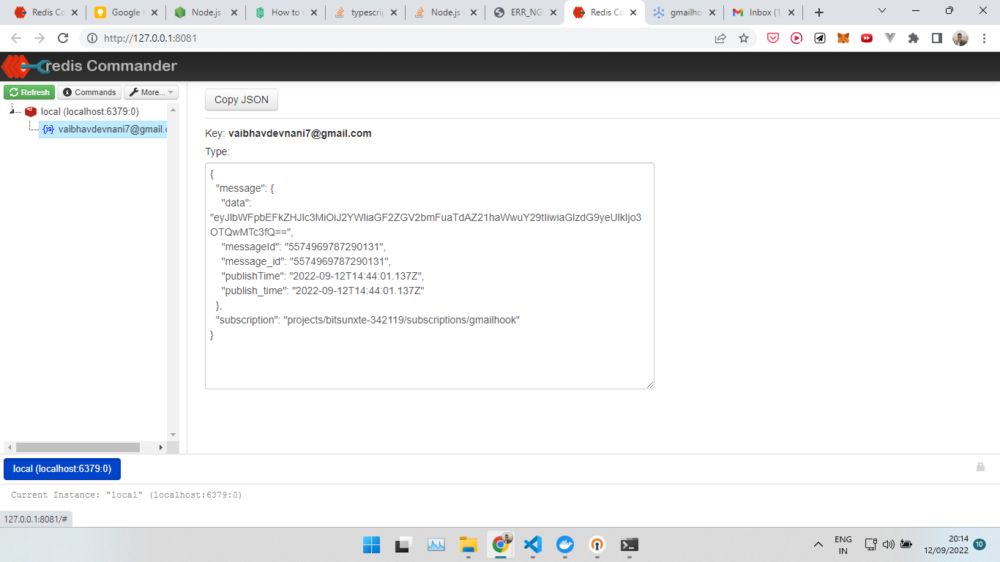

# webhooks
Typescript based node.js server made with expressjs which consumes webhooks from gmail pub/sub api and outlook graph api, and caches them in a json format into redis using redisjson.
Nginx is also used for handling concurrent requests using http caching.
Used ngrok to forward requests on local containers.
Fully containerised to be used with docker.

